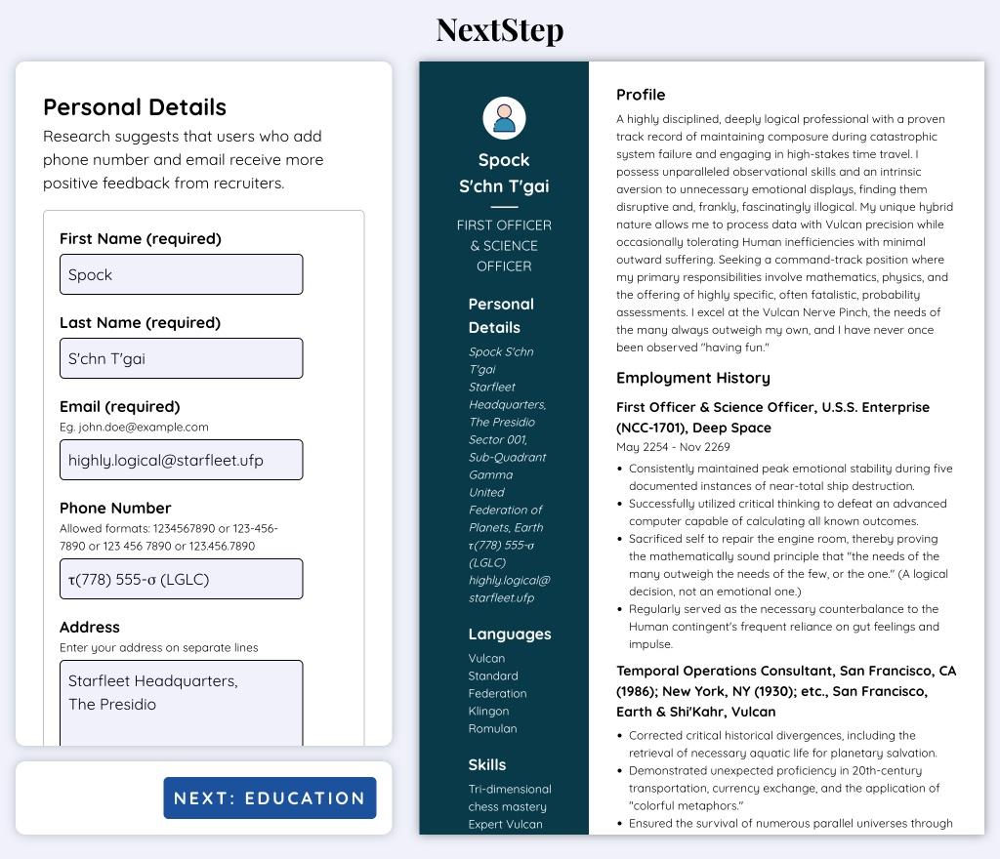
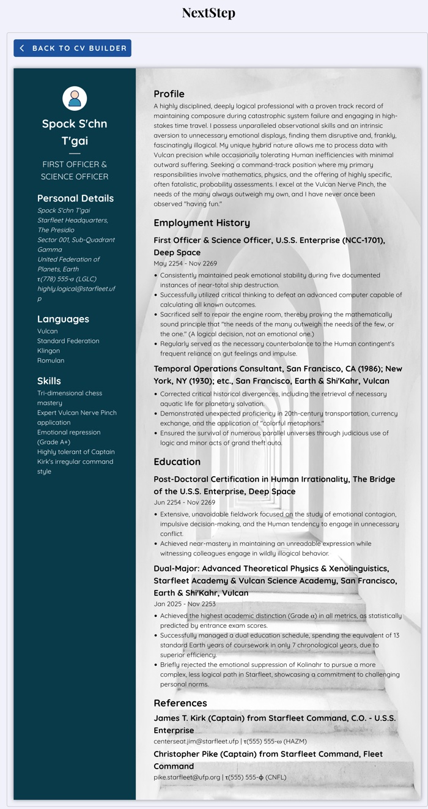

# CV Application (The Odin Project)

This is a solution for [CV Application project on The Odin Project](https://www.theodinproject.com/lessons/node-path-react-new-cv-application)

## Table of contents

- [CV Application (The Odin Project)](#cv-application-the-odin-project)
  - [Table of contents](#table-of-contents)
  - [Overview](#overview)
    - [Screenshots](#screenshots)
    - [Links](#links)
  - [Acknowledgments](#acknowledgments)
    - [Images](#images)
    - [Icons](#icons)
    - [Fonts](#fonts)

## Overview

This is a build of single webpage for The Odin Project's CV Application project to practice state in React. This project is built using React and CSS. The page renders a CV Builder and a CV Preview on initial load. The CV Builder contains a form for user to enter their details. The CV Preview previews the details entered by the user. When user clicks on the Done button after filling in all the information in the form, the CV Builder and the CV Preview are hidden and the app renders a CV Page component which displays the CV in final form. From here user can go back to the CV Builder by clicking the Back button and edit the CV.

### Screenshots

<table>
  <tr>
    <td align="center">
      
       
      <em>CV Builder and Preview</em>
    </td>
    <td align="center">
      
       
      <em>CV Template</em>
    </td>
  </tr>
</table>

### Links

- Solution URL: [https://github.com/py-code314/cv-application](https://github.com/py-code314/cv-application)
- Live Page URL: [https://chicken-run-cv-application.netlify.app/](https://chicken-run-cv-application.netlify.app/)

## Acknowledgments

### Images

- Image 'white concrete building' by Robin Schreiner on [Unsplash](https://unsplash.com/photos/white-concrete-building-7y4858E8PfA)

### Icons

- Person and Warning icons are form [Reshot](https://www.reshot.com/)
- All other icons are from [Google](https://fonts.google.com/icons)

### Fonts

- All fonts are from [Google Fonts](https://fonts.google.com/)
